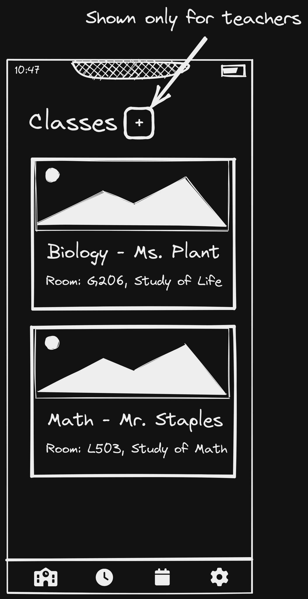

# UI Plan

This document describes most states of the UI and how it should behave and be handled. Note that not all the states are present here, because some were not necessary to be planned/described.

## Unauthenticated Pages

These UI states are shown when the user is not authenticated.

### Landing Unauthenticated

The landing page for unauthenticated users displays all the possible roles and requires the user to chose one of them. Selecting admin on this page will redirect the user to the admin login page. Any other role will redirect the user to the role's respective signup page.

### Login Page

The login page features a Sign in with GitHub button. This button will redirect the user to the GitHub OAuth page. After the user is authenticated, the user will redirect back to the app and the backend will finish up the authentication process. Finally, the user will be redirected to the home page. The login page also features a link to the signup page for users who don't yet have an account.

### Signup Page (non-admin)

The signup page has two parts to it. The first part asks the user to select which school they are signing up for. The second part asks the user to Sign in with GitHub. This goes through a similar authentication process to that of the login page. Both parts feature a link to the login page for those who already have an account.

### Signup Page (admin)

The signup page for administrators requests that the user contacts us for requesting a quote.

## Authenticated Pages

These pages are for users that are authenticated. The user will be redirected to the home page after they are authenticated.

### Home Page

The home page features the latest events and posts from the school and the user's classes. The user can also navigate to other pages through the bottom navigation bar, the navigation bar varies from user to user depending on their permissions. A social media integration is available on the home page, and an edit option for administrators.

### Social Media Integration

The social media integration is a page that allows the user to view the social media feeds of the school. The user can also navigate to other pages through the bottom navigation bar as in the home page.

### Social Media Modification

The social media modification page is only available to administrators. It allows the administrator to modify the social media feed of the school. The feed can be one of the following types: Facebook, Twitter, or Instagram.

### Classes Page

The classes page shows all of the classes of a user. It is only available to students and teachers. Teachers also have the ability to create a class which redirects them to the create class page. The class cards contain an image followed by the name of the class, the teacher, and a description. Clicking on a class card will redirect the user to the class's specific page.

### Class page

The class page shows all the posts of a specific class. Both students and teachers can create posts on this page. Clicking the plus button takes them to the post creation page.

### Model Creation Page

The model creation page is actually represented by separate pages in the front-end but has a similar UI between these routes. It is used to create classes, posts, and events. The user can fill out a form and upload an image to create a new class, post, or event.

### Settings Page

The settings page contains several sections and options allowing the user to modify their account. The personal information section contains options to modify the name and displays information on the user such as the email and their role. The linked socials allows the user to modify accounts linked to their current account. The contact info page gives links to the user to get help. The notifications page allows the user to turn on and off notifications. The advanced settings page allows the user to delete their account. The user also has the option of logging out of the application. There are also links to the licensing, privacy policy, and terms of service pages at the bottom.

### Events Page

The events page shows all of the upcoming events in the school in a calendar and agenda view. Teachers/admin also have the option to create an event in this page. Clicking on the plus button will take them to the event creation page. Teachers are prompted to select a class when creating an event.

### Members Page

The members page is an admin only page. It contains two sections, the pending users section and the invited users section. The pending users section contains users that the admin has already invited and didn't sign up yet. The invited users section contains users that the admin has invited and signed up. When opening up any of these sections, by clicking on the arrow, the admin can see each users' name. Depending on the user, there are now several options available to the admin, such as modifying their role, deleting them, or linking a parent and a child.

### Modify User

The modify user page is redirected to from the members page and is only visible for admin. It is shown when the admin selects to modify some field of a user. The admin can modify the user's role and name. For pending invites, the admin can also change the email. The form is populated by the default data in the beginning. The user can repopulate the data into the form by clicking the reset button. The user can commit changes by clicking the update button. Doing so will redirect the user back to the members page.

### Manage Children

The manage children page is only available to admin. It allows the admin to (un)link. This page is only shown when an admin tries to modify a parent in the members page.
