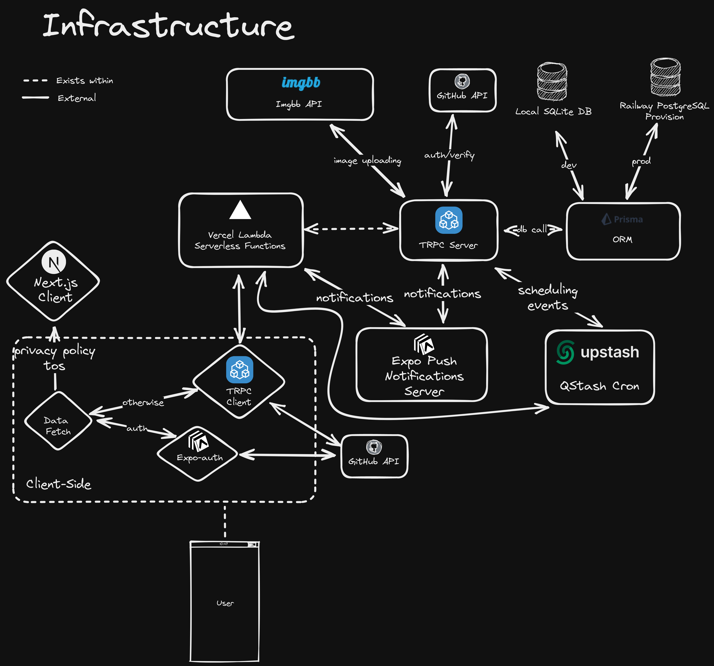

# Technology Stack

Over here, I will cover the technology stack of SchoolConnect. Here is a flowchart of the workflow of the infrastructure:

## Mobile Application

The mobile application is built with:

- React Native 0.71 + React 18
- Expo SDK Version 48
- tRPC 10
- TypeScript 4.9

## Backend

The backend is written using TypeScript 4.9 and tRPC 10.

The client side makes use of a tRPC client to connect to the backend tRPC server that is hosted on Vercel Lambda Serverless. On the backend we make use of the Imgbb API to upload images.

## Database

The database uses:

- Prisma 4.11
- PostgreSQL
- SQLite for Development Environment

## Next.js Website

The Next.js website that hosts the privacy policy, terms of service, and the backend. It uses Next.js 13 and TypeScript 4.9.

## Notifications

Notifications for the application are handled by Expo's Push Notifications API. The backend uses the Expo Server SDK to push notifications to the API. For scheduling notifications, the backend uses QStash to create a schedule.

## Documentation

The documentation site makes use of VitePress alpha version 1. VitePress allows me to statically generate the documentation and layout of the site while only worrying about the content.
